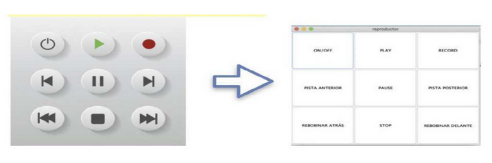

## Ej01 Interfaz de un reproductor de música

Utiliza la herramienta visual para implentar lo más preciso que puedas la ventana siguiente:

Algunos detalles más...

#### Actividad de ampliación 2

Se pide diseñar la interfaz de un reproductor de música, contemplando las siguientes especificaciones:
- Crear el JFrame llamado reproductor
- Implementar el JPanel con la disposición GridLayout, estableciendo el número apropiado de columnas y filas
  mediante GridLayout(int numFilas, int numCol).
- Añadir los nueve botones al JPanel.
- Añadir el JPanel de tipo GridLayout al reproductor de tipo JFrame.
- Realizar el empaquetado de los componentes de la ventana.
- Activar la visibilidad de la ventana.